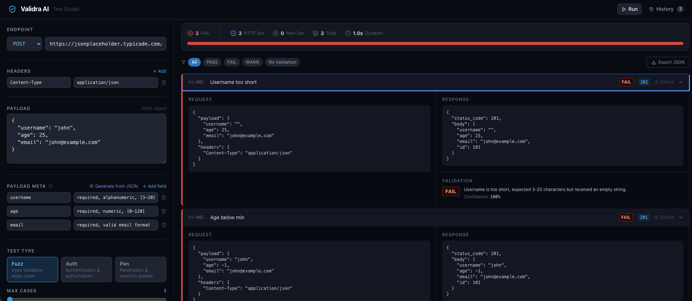

# Validra UI

Visual interface for [Validra](https://github.com/validra-ai/validra-ai-core) — AI-powered API test generation and validation.



---

## Requirements

- Node.js 20+
- Python 3.10+

---

## Run the Core API

```bash
pip install validra
validra
```

Runs on **http://localhost:8000** by default.

---

## Run the UI

```bash
npm install -g @validra-ai/ui
validra-ui
```

Open **http://localhost:3000** in your browser.

---

## Options

Use a custom port for the UI:

```bash
validra-ui --port 4000
```
